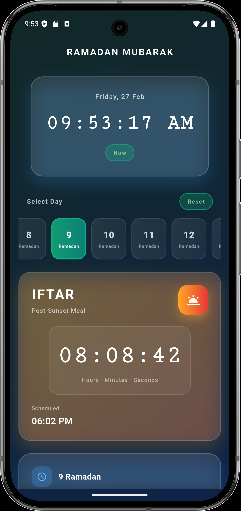
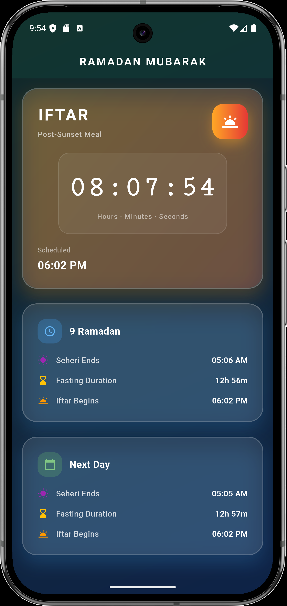

# Ramadan Seheri & Iftar Countdown App ⏳🌙

A beautiful and modern Flutter application for tracking Seheri (pre-dawn meal) and Iftar (post-sunset meal) times during Ramadan. Built with a stunning glassmorphism design and real-time countdown functionality.


## ✨ Features

### 🔔 Real-Time Countdown
- **Seheri Countdown** - Live countdown to pre-dawn meal time
- **Iftar Countdown** - Live countdown to sunset meal time
- **Smart Display** - Automatically shows appropriate countdown based on current time
- **HH:MM:SS Format** - Precise countdown with hours, minutes, and seconds

### 📅 Complete 30-Day Schedule
- Full Ramadan month schedule (Days 1-30)
- Dynamic time progression (seheri gets earlier, iftar gets later)
- Arabic date display (1 Ramadan, 2 Ramadan, etc.)
- Horizontal scrollable day selector
- Auto-detection of current Ramadan day

### 🎨 Beautiful UI/UX
- **Glassmorphism Design** - Premium frosted glass effect with blur
- **Dark Theme** - Eye-friendly dark mode optimized for nighttime use
- **Gradient Backgrounds** - Smooth green-to-blue gradient
- **Smooth Animations** - Polished animations and transitions
- **Responsive Layout** - Works perfectly on all screen sizes

### 🕐 Time Management
- Live digital clock with current date and day
- 12-hour time format with AM/PM
- Automatic day transition
- Visual indicators for upcoming meals

## 📱 App ScreenShots





## 🏗️ Project Architecture

```
lib/
├── main.dart                      # App entry point & theme
├── models/
│   └── ramadan_day.dart           # Data model for daily times
├── pages/
│   └── countdown_home.dart        # Main home screen
├── services/
│   └── ramadan_service.dart       # Ramadan schedule data
└── widgets/
    └── glassmorphic_card.dart     # Reusable glass card widget
```

### Key Components

| Component | Description |
|-----------|-------------|
| `CountdownApp` | Root MaterialApp with Material 3 dark theme |
| `CountdownHome` | Main stateful widget with countdown logic |
| `RamadanService` | Static schedule data for all 30 days |
| `RamadanDay` | Model class for day, seheri, iftar times |
| `GlassmorphicCard` | Reusable glassmorphism container |

## 📊 Ramadan 1446 Schedule

The app includes complete timing data for Ramadan 1446 AH (starting February 19, 2026):

| Period | Seheri Time | Iftar Time |
|--------|-------------|------------|
| Days 1-5 | ~5:12 - 5:09 AM | ~5:58 - 6:00 PM |
| Days 6-10 | ~5:08 - 5:05 AM | ~6:00 - 6:02 PM |
| Days 11-15 | ~5:05 - 5:01 AM | ~6:03 - 6:05 PM |
| Days 16-20 | ~5:00 - 4:57 AM | ~6:05 - 6:07 PM |
| Days 21-25 | ~4:56 - 4:52 AM | ~6:07 - 6:09 PM |
| Days 26-30 | ~4:51 - 4:47 AM | ~6:09 - 6:11 PM |

> 📍 Times are configured for Bangladesh (Asia/Dhaka timezone)

## 🎨 Color Palette

| Element | Color | Hex Code |
|---------|-------|----------|
| Primary | Emerald Green | `#10B981` |
| Secondary | Amber | `#F59E0B` |
| Surface | Dark Blue | `#0F172A` |
| Seheri Gradient | Purple → Blue | `#A855F7` → `#2563EB` |
| Iftar Gradient | Orange → Red | `#EA580C` → `#DC2626` |

## 🚀 Getting Started

### Prerequisites
- Flutter SDK 3.x or higher
- Dart SDK 3.x or higher
- Android Studio or VS Code

### Installation

```bash
# Clone the repository
git clone <repository-url>

# Navigate to project directory
cd count_down

# Get dependencies
flutter pub get

# Run the app
flutter run

# Build for release
flutter build apk --release
```

### Running on Different Platforms

```bash
# Android
flutter run -d android

# iOS
flutter run -d ios

# Web
flutter run -d chrome

# macOS
flutter run -d macos
```

## 🔧 Customization

### Modify Ramadan Times

Edit [`lib/services/ramadan_service.dart`](lib/services/ramadan_service.dart):

```dart
RamadanDay(
  day: 1,
  seheriTime: const TimeOfDay(hour: 5, minute: 12),
  iftarTime: const TimeOfDay(hour: 17, minute: 58),
  arabicDate: '1 Ramadan',
),
```

### Change Theme Colors

Edit [`lib/main.dart`](lib/main.dart):

```dart
colorScheme: ColorScheme.dark(
  primary: const Color(0xFF10B981),  // Change primary color
  secondary: const Color(0xFFF59E0B), // Change secondary color
  surface: const Color(0xFF0F172A),   // Change background
),
```

### Adjust Glass Effect

Edit [`lib/widgets/glassmorphic_card.dart`](lib/widgets/glassmorphic_card.dart):

```dart
// Adjust blur intensity
filterur(sigmaX: ImageFilter.bl: 12, sigmaY: 12),  // Higher = more blur

// Adjust transparency
color: Colors.white.withOpacity(0.10),  // Higher = more opaque
```

## 📱 Key Features Explained

### Countdown Logic
```
Current Time < Seheri Time → Show Seheri Countdown
Seheri Time ≤ Current Time < Iftar Time → Show Iftar Countdown
Current Time ≥ Iftar Time → Show Next Day's Seheri Countdown
```

### Auto Day Detection
The app automatically detects the current Ramadan day based on system date and highlights it in the day selector.

## 🛠️ Technical Details

### Dependencies
- Flutter SDK
- Material 3 Design System
- Dart Timer API
- BackdropFilter for blur effects

### State Management
- `setState()` for reactive UI updates
- `Timer.periodic()` for 1-second countdown updates
- `AnimationController` for smooth animations

### Performance
- Efficient widget rebuilding
- Proper resource cleanup in `dispose()`
- Optimized blur effects
- 60fps smooth animations

## 🤝 Contributing

Contributions are welcome! Please feel free to submit a Pull Request.

1. Fork the repository
2. Create your feature branch (`git checkout -b feature/amazing-feature`)
3. Commit your changes (`git commit -m 'Add some amazing feature'`)
4. Push to the branch (`git push origin feature/amazing-feature`)
5. Open a Pull Request

## 📄 License

This project is licensed under the MIT License - see the LICENSE file for details.

## 🙏 Acknowledgments

- Ramadan Kareem 🕌
- Inspired by the blessed month of Ramadan
- Built with ❤️ using Flutter

---

<div align="center">

**Ramadan Kareem! 🌙✨**

*May this Ramadan bring peace, prosperity, and blessings to all.*

</div>
